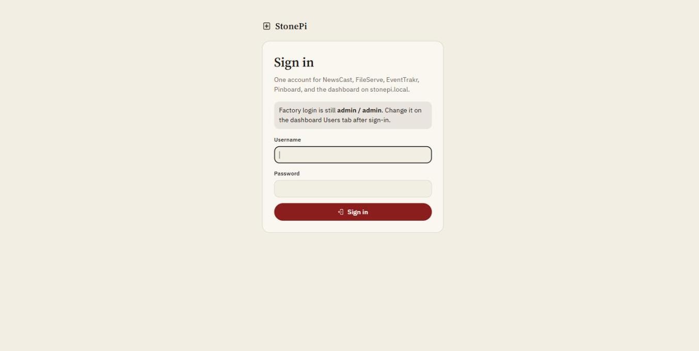
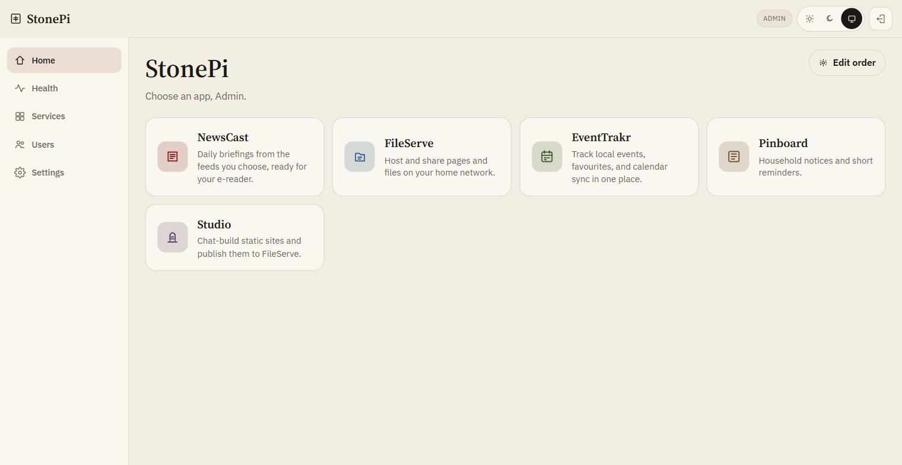
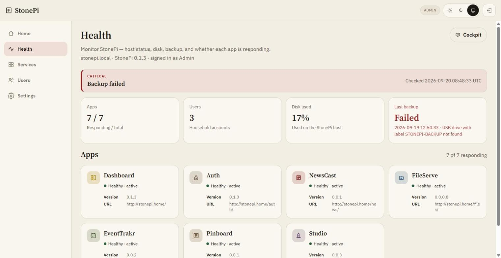
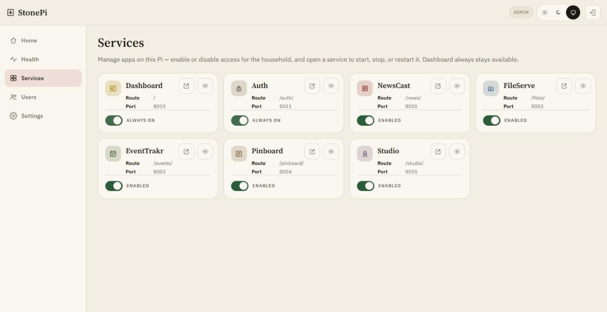
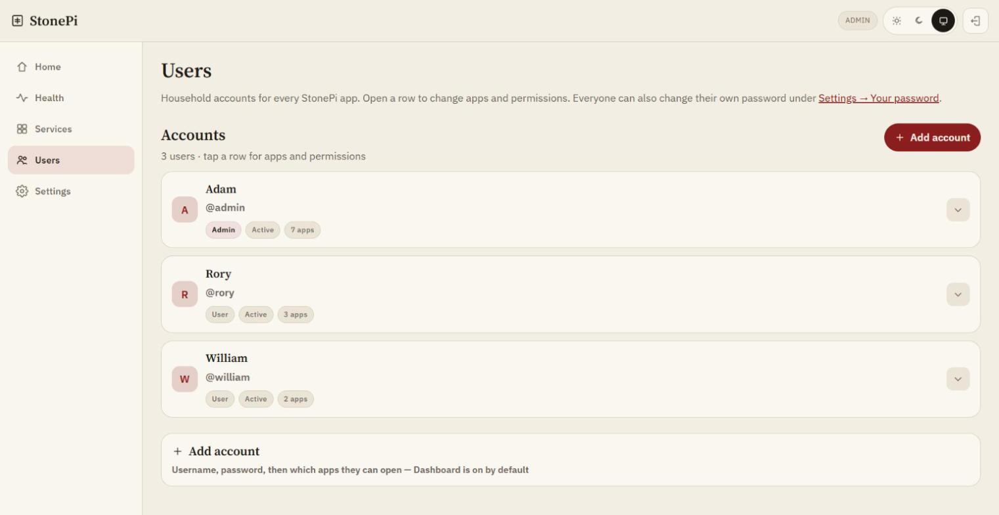
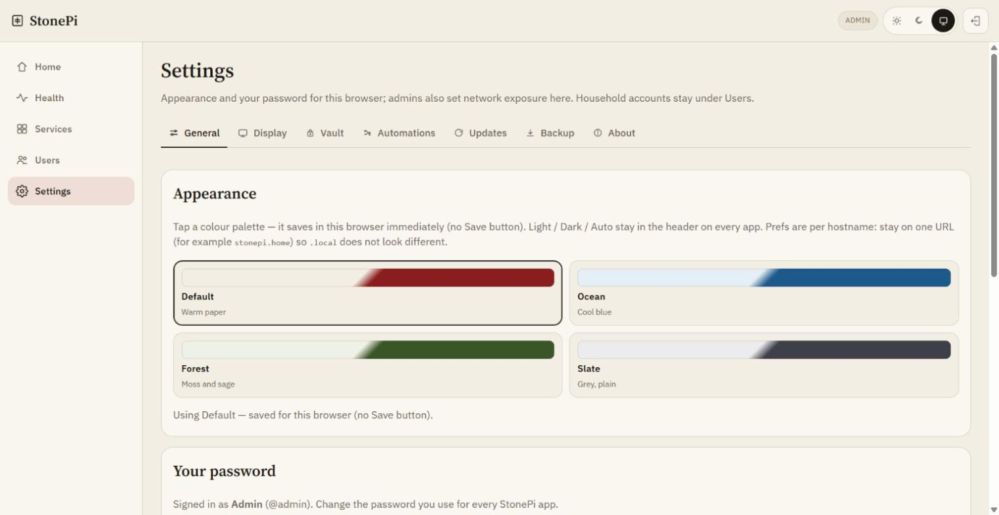

# StonePi

**StonePi** is a household LAN portal on one Raspberry Pi: shared sign-in, phone-first apps, and optional e-ink and AI. Hostname: `stonepi.local` (or your router name, e.g. `stonepi.home`).

It is for the jobs that usually scatter across school portals, cloud drives, and sticky notes — daily reading, hosting pages on your network, local events, family notices, and small sites the household builds itself.

**Cockpit** (`:9090`) is for the Linux host. The **Dashboard** is for people, apps, updates, backup, and platform services.

## Screenshots

| | |
|:---:|:---:|
|  |  |
| *Shared sign-in* | *Home — drag-to-order launcher* |
|  |  |
| *Health — monitor host and apps* | *Services — enable / disable apps* |
|  |  |
| *Users — household accounts* | *Settings → General* |

More images: [docs/screenshots/](docs/screenshots/).

## What’s included

### Launcher apps

| App | Purpose | Why it’s in the stack | Key usage |
|-----|---------|------------------------|-----------|
| **[NewsCast](apps/newscast/README.md)** | Daily briefings from feeds you choose, ready for an e-reader | “What’s worth reading” without five news apps | Sources / Device; RSS or scrape; OPDS / CrossPoint / KOReader; optional LLM, translation, ntfy |
| **[FileServe](apps/fileserve/README.md)** | Host HTML, PDF, Word, or zip sites on the LAN | Household “put it on a URL” without the cloud | Keep-until + optional password; per-user `/u/…`; Studio publish target |
| **[EventTrakr](apps/eventtrakr/README.md)** | Local events, favourites, and calendar sync | Complements news with “what’s on near us” | 7-day agenda; ICS/webcal; Google Calendar; Bright Data for Facebook events |
| **[Pinboard](apps/pinboard/README.md)** | Household notices and short reminders | Shared fridge-door; feeds the wall display | Grant-gated; Display / TRMNL Pinboard block |
| **[Studio](apps/studio/README.md)** | Chat-build static sites (SPA, Guide, Game) | Family authoring without a laptop toolchain | Vault LLM keys; publishes to FileServe with the same expiry/password options |
| **[PriceScout](apps/pricescout/README.md)** | Weekly supermarket offers and cross-store compare | Household shopping without five retailer apps | eTilbudsavis JSON; optional Salling madspild |
| **[SportGuide](apps/sportguide/README.md)** | Sports TV / stream schedules (Now + Sources) | What’s on without juggling guide sites | Playwright scrapes (AusSportGuide + WheresTheMatch) |

### Portal (not launcher tiles)

| App | Role |
|-----|------|
| **[Dashboard](apps/dashboard/README.md)** | Home launcher, **Health**, **Services**, Users/grants, Settings |
| **[Auth](apps/auth/README.md)** | Shared household sign-in — one account, one cookie across apps |

Admin nav split:

| Nav | Job |
|-----|-----|
| **Health** (`/overview`) | Monitor the host — alerts, disk, backup, whether each app is responding |
| **Services** (`/applications`) | Manage apps — enable/disable for the household; open a service to start/stop/restart |

## How it fits together

```text
Portal     Dashboard + Auth (people, grants, exposure, secrets, Health / Services)
Consume    NewsCast (briefings / e-readers) · EventTrakr (events / calendars)
Publish    Studio ──publish──▶ FileServe hosted pages
Glance     Pinboard + Health alerts / apps ──▶ Display (Status wall · Household · Custom) ──▶ TRMNL
```

- **Studio → FileServe** — generated zips land under the user’s Hosted Pages.
- **Dashboard → Settings → Display** — collects Display JSON over loopback, generates Liquid markup, and pushes `merge_variables` to a Private Plugin webhook. You must paste **Copy markup** into TRMNL once (or after design changes); pushes do not replace plugin markup.
- **NewsCast → readers** — OPDS catalogs and optional X3 Sync for CrossPoint / KOReader.
- **Vault** — encrypted home for integration keys (LLM, Bright Data, Google, webhook, ntfy, session).

## Home launcher

On **Home**, tiles follow each user’s saved order. **Edit order** → drag tiles to place → **Done** (order autosaves while dragging).

## What you’ll need

StonePi itself only needs a **Raspberry Pi** on your home network and a phone or laptop. Everything below is **optional** — add the pieces that match how your household wants to use it. Keys go in **Dashboard → Settings → Vault** (not scattered in chat apps).

### Hardware (optional)

| Want… | Get… | Notes |
|-------|------|--------|
| Daily paper on an e-reader | **[Xteink X3 / X4](https://www.xteink.com/products/xteink-x3)** + **[CrossPoint](https://crosspointreader.com/)** firmware | Prefer buying from [xteink.com](https://www.xteink.com/) (or official channels) so the unit can flash CrossPoint. NewsCast talks OPDS / push over your LAN. Setup: [NewsCast README](apps/newscast/README.md#e-reader). |
| Same idea on a Kobo | Any Kobo that runs **[KOReader](https://koreader.rocks/)** | Add StonePi’s OPDS catalog in KOReader; push uses KOReader’s SSH when you want Send-tab files on the device. |
| Fridge / desk glance board | **[TRMNL](https://trmnl.com/)** ([shop](https://shop.trmnl.com/)) | Wire a Private Plugin webhook under **Dashboard → Settings → Display**. Pinboard notices and other blocks appear on the panel. |
| Comfortable EventTrakr scraping | **Pi 4 or Pi 5** | Some event sites need a real browser (Playwright / Chromium). A Pi 3 will struggle. |

### Cloud & AI keys (optional)

| Want… | Get… | Put the key in Vault as… |
|-------|------|---------------------------|
| Shorter NewsCast briefings | **[OpenAI](https://platform.openai.com/api-keys)** API key, or a local **[Ollama](https://ollama.com/)** model on the LAN | `OPENAI_API_KEY` — or point NewsCast → LLM at Ollama (no OpenAI key). Refresh still works with plain extracted text if you skip AI. |
| Translate feeds into another language | Same OpenAI / Ollama path, or NewsCast’s Google translate option | NewsCast → **Settings → Translation** (provider + target language). |
| Studio chat-build sites | **[Anthropic](https://console.anthropic.com/)** and/or **OpenAI** key; optional OpenAI-compatible base URL | `ANTHROPIC_API_KEY`, `OPENAI_API_KEY`, optional `STUDIO_LLM_BASE_URL`. Without a key, Studio cannot call a model. |
| Facebook Events in EventTrakr | **[Bright Data](https://brightdata.com/)** API access ([Facebook Events scraper docs](https://docs.brightdata.com/api-reference/scrapers/social-media-apis/facebook-events-discover-by-url)) | `BRIGHTDATA_API_KEY`. Catalog, ICS, and normal web sources still work without it. |
| Favourites → Google Calendar | Google Cloud OAuth client for your household | `GOOGLE_CLIENT_ID`, `GOOGLE_CLIENT_SECRET` — EventTrakr → Integrations. |
| Phone buzz when the paper is ready | **[ntfy](https://ntfy.sh/)** topic (hosted or self-hosted) | NewsCast → Notifications (token in Vault as `NEWSCAST_NTFY_TOKEN` when used). |

**Studio in one line:** add an Anthropic and/or OpenAI key to Vault, open **Studio**, pick SPA / Guide / Game, chat, then **Publish** to FileServe (same keep-until and password options as Hosted Pages).

**Readers in one line:** flash CrossPoint on an X3/X4 (or use KOReader on Kobo), open NewsCast → Status, copy your OPDS URL onto the device.

## Platform services

Admin **Settings** tabs (not Home tiles):

| Tab | Role |
|-----|------|
| **Display** | TRMNL webhook, design presets (Status wall / Household / Custom), landscape preview, scheduled push (`stonepi_display`) |
| **Vault** | Encrypted secrets for apps and services (`stonepi_vault`) |
| **Automations** | Thin when→then (USB→backup, Health/backup→Display push) |

## Integrations (where to turn them on)

Optional bolt-ons — core apps work without them. Prefer **Settings → Vault** for API keys; details above under **What you’ll need**.

| Integration | Where in StonePi | What it enables |
|-------------|------------------|-----------------|
| **TRMNL** | Dashboard → Settings → Display (webhook may live only in Vault as `DISPLAY_WEBHOOK_URL`) | Private Plugin webhook; pick a **design** (Status wall, Household focus, or Custom); **Copy markup** into TRMNL’s Markup editor (StonePi only pushes `merge_variables`); Save / Push now. Status wall is an ops board (Services + Alerts + Storage). Household is Health alerts / Apps + product cards. Custom is freeform blocks. Preview is landscape 800×480 (OG) / 1040×780 (V2), scaled to fit the Settings column. Outbound POSTs are https-only. On the public edge, nginx denies app `/api/display` routes ([`stonepi-public-deny-display.conf`](deploy/nginx/stonepi-public-deny-display.conf)); the dashboard still scrapes via loopback. |
| **AI / LLM** | NewsCast → LLM; Studio via Vault | OpenAI, Anthropic, or Ollama / local base URL. NewsCast writes short briefings (extracted text if no model). Studio generates sites. |
| **Translation** | NewsCast → Translation | Per-feed or global; Google or LLM; target language for Translate feeds. |
| **Bright Data** | EventTrakr → Integrations | Facebook Events discover/scrape when keyed; otherwise catalog/ICS/browser paths still work. |
| **E-readers** | NewsCast → Reader | CrossPoint (X3/X4), KOReader OPDS; Sync-style API. LAN vs internet-facing token rules: [deploy/SECURITY.md](deploy/SECURITY.md). |
| **Calendars** | EventTrakr | `.ics` download, webcal feed, Google OAuth forward. |
| **ntfy** | NewsCast → Notifications | Phone alerts when the paper publishes or reaches the reader (capability-gated for non-admins). |

## Security posture

Default install is **trusted home network (LAN)**. Flip to **Internet-facing** under Dashboard → Settings → Network when you expose the portal beyond the LAN (no service restart). Tailscale remote access is also under Network (preinstalled on the Pi). Checklist: **[deploy/SECURITY.md](deploy/SECURITY.md)**.

## Quick start on a fresh Pi

1. Flash **Raspberry Pi OS** with Imager — enable **SSH**, set user/password (and Wi‑Fi if needed).
2. Copy this folder onto the SD **boot** partition (Windows sees it after imaging), e.g. `bootfs/stonePi/`.  
   Helper: `scripts\copy-to-sd.bat E:\` (skips `.venv` / `data` / `.git`).
3. Boot the Pi and SSH in:
   ```bash
   ssh YOURUSER@stonepi.local
   ```
4. Install (use `bash` — boot is FAT, so `./` execute bits are unreliable):
   ```bash
   sudo bash /boot/firmware/stonePi/deploy/install.sh --hostname stonepi
   ```
5. Open http://stonepi.local/ and sign in with **admin** / **admin**, then change the password.

Full walkthrough, boot units, backup USB, and troubleshooting: **[deploy/INSTALL.md](deploy/INSTALL.md)**.  
Interactive checklist (open in a browser): **[deploy/walkthrough.html](deploy/walkthrough.html)**.

The installer enables systemd services so everything comes back after a reboot. Re-running it is safe: it keeps `/var/lib/stonepi` and existing `/etc/stonepi/*.env` files.

## URLs (on the Pi)

| Address | Service |
|---------|---------|
| http://stonepi.local/ | Home (app launcher) |
| http://stonepi.local/overview | Health (admin monitor) |
| http://stonepi.local/applications | Services (enable / disable) |
| http://stonepi.local/auth/login | Sign in |
| http://stonepi.local/news/ | NewsCast |
| http://stonepi.local/files/ | FileServe |
| http://stonepi.local/events/ | EventTrakr |
| http://stonepi.local/pinboard/ | Pinboard |
| http://stonepi.local/studio/ | Studio |
| http://stonepi.local/prices/ | PriceScout |
| http://stonepi.local/sports/ | SportGuide |
| https://stonepi.local:9090 or https://PI_LAN_IP:9090 | Cockpit |

Same paths work via the Pi LAN IP or a router DNS name (e.g. `http://stonepi.home/`). Prefer router DNS when Avahi `.local` is unreliable.

## Windows development

```bat
scripts\run-dev.bat
```

Creates per-app virtualenvs and starts:

| URL | App |
|-----|-----|
| http://127.0.0.1:8010/ | Dashboard |
| http://127.0.0.1:8011/login | Auth |
| http://127.0.0.1:8001/ | NewsCast |
| http://127.0.0.1:8002/ | FileServe |
| http://127.0.0.1:8003/ | EventTrakr |
| http://127.0.0.1:8004/ | Pinboard |
| http://127.0.0.1:8005/ | Studio |
| http://127.0.0.1:8006/ | PriceScout |
| http://127.0.0.1:8007/ | SportGuide |

SSO is shared on `127.0.0.1`. Solo `run-local.bat` still works if `STONEPI_SESSION_SECRET` is unset. On the Pi (with session secret set), **Users**, **Updates**, and **Backup** live under dashboard Settings; in-app Users/Update tabs are for solo runs only.

## Pi helpers after install

```bash
stonepi status
stonepi restart
stonepi logs
stonepi urls
```

## Backup

Label a USB stick **STONEPI-BACKUP** and plug it into the Pi — backup starts automatically (or run `sudo systemctl start stonepi-backup`). Details: [deploy/backup/RESTORE.md](deploy/backup/RESTORE.md).

## Updates

GitHub Releases should attach **StonePi-labelled** per-app zips (`stonepi-dashboard-0.0.2.zip`, …) plus `stonepi-platform-0.1.1.zip`. These are portal variants — not standalone upstream apps. Build them with:

```bash
python scripts/build_release_zips.py --all
```

Admins install from Dashboard → Settings → Updates (or each app’s Settings → Update on a solo run).

Platform notes: [CHANGELOG.md](CHANGELOG.md). Release steps: [deploy/RELEASE.md](deploy/RELEASE.md).

## Layout

```text
apps/auth            shared login
apps/dashboard       home launcher + admin (Health / Services)
apps/newscast
apps/fileserve
apps/eventtrakr
apps/pinboard
apps/studio
apps/pricescout
apps/sportguide
packages/stonepi_auth
packages/stonepi_update
packages/stonepi_display
packages/stonepi_watch
packages/stonepi_vault
packages/stonepi_automations
docs/screenshots     README gallery
deploy/install.sh    Pi installer
deploy/INSTALL.md    fresh OS guide
deploy/RELEASE.md    release checklist
deploy/walkthrough.html
scripts/run-dev.bat  Windows
scripts/copy-to-sd.bat
scripts/build_release_zips.py
```
