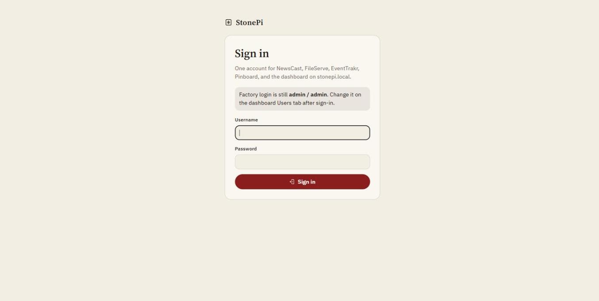
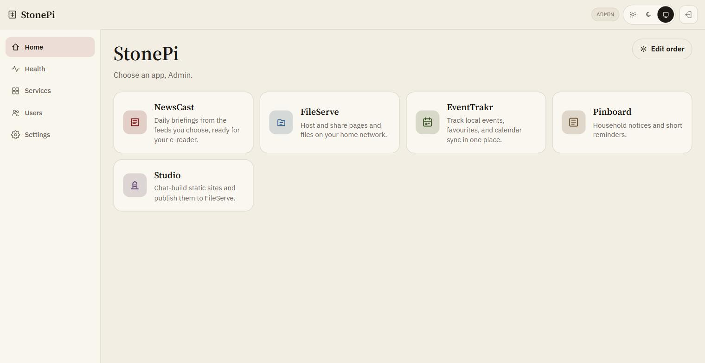
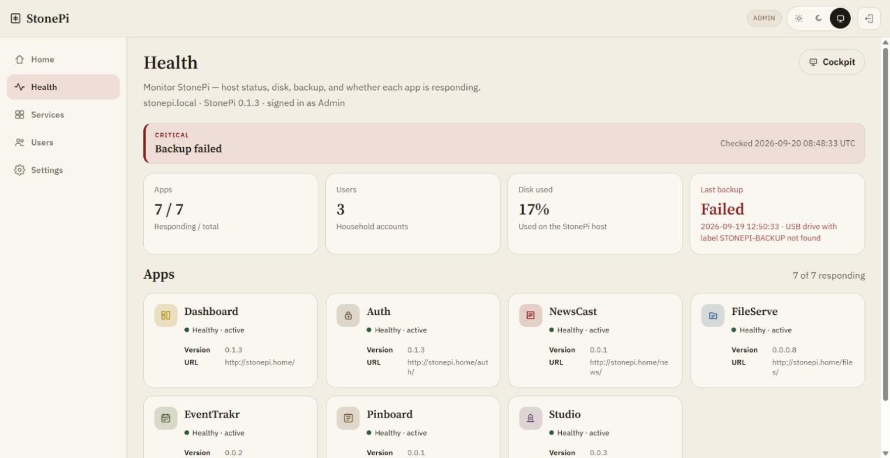
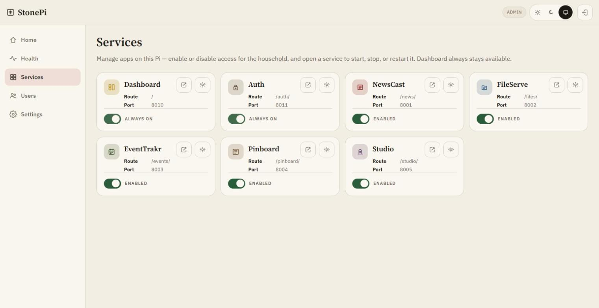
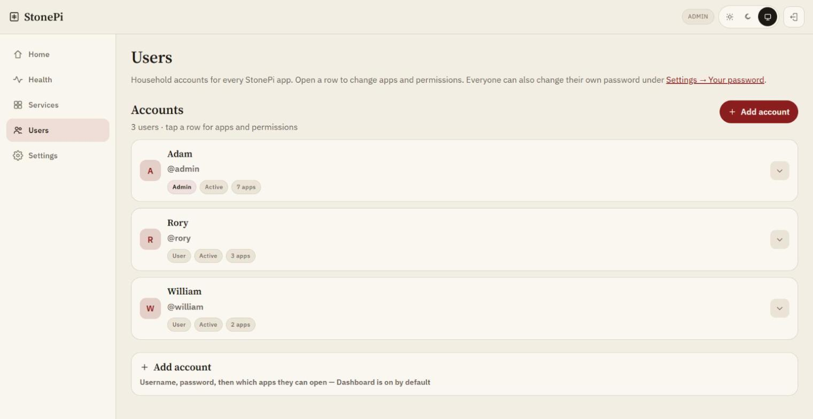
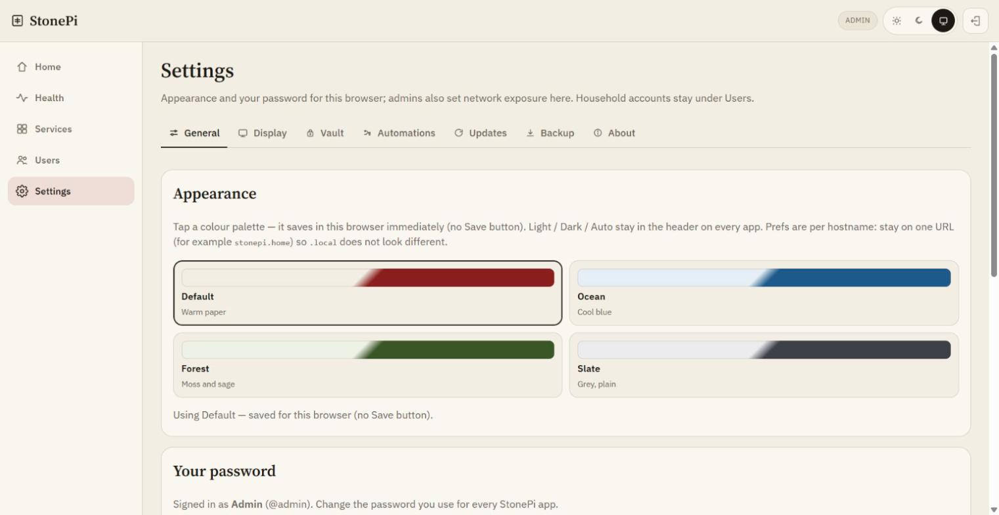

# StonePi

**The bedrock of your digital home.**

StonePi is a private hub for your home on one Raspberry Pi. It brings you the news you want on your e-reader, shows what's on locally and in sport, finds supermarket deals, watches prices, keeps Wikipedia offline, hosts your household's files and small sites, and pushes useful updates to your phone, a wall display or a desk panel. Everything sits behind one shared sign-in, on your own network, set up once and left running.

> **Set up a Pi: [stonepi-install.vercel.app](https://stonepi-install.vercel.app)** — one command on stock Raspberry Pi OS (64-bit) for a Raspberry Pi 4 or 5.

## Screenshots

| | |
|:---:|:---:|
|  |  |
| *Shared sign-in* | *Home — drag-to-order launcher* |
|  |  |
| *Health — monitor host and apps* | *Services — enable / disable apps* |
|  |  |
| *Users — household accounts* | *Settings → General* |

More images: [docs/screenshots/](docs/screenshots/).

## Apps

Home tiles. Each app has its own README with setup details.

| App | Path | What it does |
|-----|------|--------------|
| **[NewsCast](apps/newscast/README.md)** | `/news/` | A daily paper from feeds you choose, for phone or e-reader (OPDS for CrossPoint and KOReader). Optional AI summaries and translation. |
| **[EventTrakr](apps/eventtrakr/README.md)** | `/events/` | What's on near you: a 7-day agenda from websites, ICS feeds, Facebook events and Instagram accounts; favourites; webcal and Google Calendar; an optional public agenda. |
| **[SportGuide](apps/sportguide/README.md)** | `/sports/` | Sports TV and stream schedules (AFL, cricket, rugby, football) for the teams you follow, with kick-off alerts. |
| **[PriceScout](apps/pricescout/README.md)** | `/prices/` | This week's supermarket offers across Danish chains, a shopping list, and Salling food-waste deals for the household postcode. |
| **[PriceWatch](apps/pricewatch/README.md)** | `/watch/` | Watch named products on PriceRunner until they hit your price; Compare every retailer's offer, with Trustpilot trust scores. |
| **[Library](apps/library/README.md)** | `/library/` | Wikipedia, Wikivoyage, Gutenberg and other references offline through Kiwix, on microSD, USB or SSD; the reader is behind sign-in. |
| **[FileServe](apps/fileserve/README.md)** | `/files/` | Put HTML, PDF, Word or zip sites on a household URL, with keep-until and passwords. Hosted pages load sandboxed. |
| **[Studio](apps/studio/README.md)** | `/studio/` | Chat-build a simple site, guide or game and publish it to FileServe. |
| **[Pinboard](apps/pinboard/README.md)** | `/pinboard/` | Household notices and reminders, on phones and displays. |

## Platform

Always on; not Home tiles.

| Part | Path | Role |
|------|------|------|
| **[Dashboard](apps/dashboard/README.md)** | `/` | Home launcher, **Health** (host and apps, updates live), **Services** (enable, start, stop, restart, logs) and admin **Settings**: Users, Network, Vault, Updates, Backup, Automations. |
| **[Auth](apps/auth/README.md)** | `/auth/` | One household sign-in across every app. |
| **[Notify](apps/notify/README.md)** | `/notify/` | Where apps' updates go: TRMNL wall displays, the Car Thing panel, and ntfy phone alerts. |
| **[Car Thing](apps/carthing/README.md)** | (USB) | A Spotify Car Thing plugged into the Pi becomes a touch-and-dial panel: pages of widgets (System, clock and weather, sport, events, news, Pinboard) that turn on a timer or by button, a clock when idle, and service restarts behind an admin PIN. Set up under Notify → Displays → Car Thing. Ships with the platform. |
| **[Recover](apps/recover/README.md)** | `/recover/`, `:8099` | Recovery Console for when the portal itself is down: restart services, restore a backup. |
| **[Cockpit](https://cockpit-project.org/)** | `:9090` | Web console for the Raspberry Pi's operating system, separate from StonePi: system updates, storage, networking, logs and a terminal in the browser. Installed by the installer; sign in with your Pi's Linux user, not your StonePi account. |

**Displays and alerts.** Apps own their data and only emit when something useful happens; Notify decides where it goes.

- **TRMNL** (e-ink, for a wall or fridge): one Display per screen, laid out in a drag-and-drop builder over a real render of the device, pushed on a timer.
- **Car Thing** (touch and dial, for a desk or dash): saved configs with pages, widget sizes, button and dial actions and clock faces, edited beside a live preview. The device keeps its own firmware and gets its screen back when the panel is switched off.
- **ntfy** (phone): paper ready, a PriceWatch strike, an event or kick-off you follow, a backup that needs attention.

## People and permissions

Admins add people under **Users**, choose which apps each person can open, and what they may do inside each app. Admins can do everything. A permission takes the default below until an admin changes it for that person; revoking one also stops that person's background jobs (scheduled scrapes, alerts) within five minutes.

| App | Permission | Default for members |
|-----|------------|---------------------|
| NewsCast | Add custom feeds · View status | off · off |
| EventTrakr | Manage sources · Instagram & Facebook (paid lookups) · Share agenda publicly · Google Calendar sync | on · **off** · on · on |
| PriceScout | Manage sources (stores, refresh) | off |
| PriceWatch | Manage watches · Manage sources · Strike alerts | on · off · on |
| SportGuide | Refresh schedules | off |
| Library | Manage content (install, update, remove) | off |
| FileServe | Publish pages · Publish without a password | on · **off** |
| Studio | Use LLM · Publish to FileServe | off · off |
| Pinboard | Post notices · Assign reminders to others | on · on |

Defaults that are off cover shared or costly actions: refresh scrapes, multi-gigabyte downloads, paid lookups, AI spend and publishing open pages. Household-wide settings (NewsCast's paper layout and filters, Library storage and backups, PriceWatch retention and lookups, the PriceScout postcode, the Bright Data limit) are admin-only.

## Optional extras

StonePi needs only the Pi and a phone or laptop. Add what fits your household; keys go in **Dashboard → Settings → Vault**.

| Want… | Get… | Where |
|-------|------|-------|
| The paper on an e-reader | **[Xteink X3 / X4](https://www.xteink.com/products/xteink-x3)** with **[CrossPoint](https://crosspointreader.com/)**, or a Kobo with **[KOReader](https://koreader.rocks/)** | NewsCast → Reader ([setup](apps/newscast/README.md#e-reader)) |
| A wall or fridge display | **[TRMNL](https://trmnl.com/)** | Notify → Displays: one Private Plugin per screen, webhook in Vault |
| A desk or dash control panel | **Spotify Car Thing** with ADB-enabled firmware, on USB | Notify → Displays → Car Thing |
| Phone alerts | **[ntfy](https://ntfy.sh/)** topic (hosted or self-hosted) | Notify → Destinations (`STONEPI_NTFY_TOKEN`) |
| AI summaries and translation in NewsCast | **[OpenAI](https://platform.openai.com/api-keys)** key or a local **[Ollama](https://ollama.com/)** model | NewsCast → LLM / Translation (`OPENAI_API_KEY`); works without, using extracted text |
| Studio | **[Anthropic](https://console.anthropic.com/)** and/or OpenAI key | `ANTHROPIC_API_KEY`, `OPENAI_API_KEY`, optional `STUDIO_LLM_BASE_URL` |
| Facebook events and Instagram in EventTrakr | **[Bright Data](https://brightdata.com/)** | `BRIGHTDATA_API_KEY` |
| Retailer trust scores in PriceWatch | Bright Data (Trustpilot) | `PRICEWATCH_BRIGHTDATA_API_KEY` |
| Favourites in Google Calendar | A Google Cloud OAuth client | EventTrakr → Integrations (`GOOGLE_CLIENT_ID`, `GOOGLE_CLIENT_SECRET`) |
| Supermarket food-waste deals | Salling Group API token | PriceScout |
| Remote access | **[Tailscale](https://tailscale.com/)** (installed by the installer) | Settings → Network |

Every app's Bright Data use counts against one shared monthly limit (default 5,000 records), set by an admin in EventTrakr or PriceWatch.

## Install

1. Flash **Raspberry Pi OS Lite (64-bit)** with Raspberry Pi Imager for a Pi 4 or 5: hostname `stonepi`, SSH on, your user and password (and Wi-Fi if needed).
2. SSH in and run the installer:
   ```bash
   ssh YOURUSER@stonepi.local
   ```
   ```bash
   curl -fsSL https://stonepi-install.vercel.app/install.sh | sudo bash
   ```
3. Open http://stonepi.local/ (or `http://<pi-ip>/`) and sign in as **admin** with the random password printed at the end, then change it. To see it again: `sudo cat /etc/stonepi/initial-admin.txt`. The Recovery Console's own password (user `stonepi`) is printed there too: `sudo cut -d: -f2- /etc/stonepi/recover.passwd`.

The installer checks the release's checksum, ends with a ready check, and is safe to re-run: an interrupted install picks up where it stopped, and existing data and settings are kept. Everything comes back after a reboot.

Something broken on an existing Pi? **[stonepi-install.vercel.app/recover](https://stonepi-install.vercel.app/recover)**. Full guide and troubleshooting: **[deploy/INSTALL.md](deploy/INSTALL.md)**.

**From a local copy** (development or offline): copy this folder onto the SD card's boot partition (`scripts\copy-to-sd.bat E:\` skips `.venv`, `data` and `.git`), then on the Pi run `sudo bash /boot/firmware/stonePi/deploy/install.sh --hostname stonepi`.

## Running it

- **Addresses:** every path above works on `http://stonepi.local/`, the Pi's LAN IP, or a router name such as `http://stonepi.home/` (use that when `.local` is unreliable).
- **Security:** a fresh install trusts the home network. Switch to **Internet-facing** under Settings → Network before exposing it beyond your LAN. Checklist: [deploy/SECURITY.md](deploy/SECURITY.md).
- **Backup:** plug in a USB stick labelled **STONEPI-BACKUP** and backup starts automatically, or schedule local backups under Settings → Backup. Restore: [deploy/backup/RESTORE.md](deploy/backup/RESTORE.md).
- **Updates:** Settings → Updates lists the platform and every app. App updates are checked against the release's `SHA256SUMS`, installed by a root helper, and rolled back if the app doesn't come back healthy. Platform updates re-run the installer: `curl -fsSL https://stonepi-install.vercel.app/install.sh | sudo bash -s -- --reinstall`.
- **On the Pi:** `stonepi status`, `stonepi restart`, `stonepi logs`, `stonepi urls`.

## Development

On Windows, `scripts\run-dev.bat` creates per-app virtualenvs and starts everything on `127.0.0.1` with shared sign-in:

| | Port | App | Notes |
|-|------|-----|-------|
| **System** | 8010 | Dashboard | |
| | 8011 | Auth | |
| | 8012 | Notify | Car Thing editor at `/notify/displays/carthing` |
| | 8013 | Car Thing panel | Preview; with `adb` on PATH it also drives a plugged-in Car Thing |
| **Home apps** | 8001 | NewsCast | |
| | 8002 | FileServe | |
| | 8003 | EventTrakr | |
| | 8004 | Pinboard | |
| | 8005 | Studio | |
| | 8006 | PriceScout | |
| | 8007 | SportGuide | |
| | 8008 | PriceWatch | |
| | 8009 | Library | No Kiwix on Windows |

Recover (`:8099` on the Pi) isn't started in dev.

Each app and package has a `tests/` folder (`python -m pytest -q` with the `packages/*` folders on `PYTHONPATH`). Releases: build with `python scripts/build_release_zips.py --all` and follow [deploy/RELEASE.md](deploy/RELEASE.md); versions and notes are in [CHANGELOG.md](CHANGELOG.md). System apps and the Car Thing share the platform version; Home apps have their own.

```text
apps/            dashboard, auth, notify, recover, carthing (platform)
                 newscast, eventtrakr, sportguide, pricescout, pricewatch,
                 library, fileserve, studio, pinboard (Home apps)
packages/        stonepi_auth      sign-in, app catalog and permissions, Auth roster, platform lock
                 stonepi_vault     encrypted secrets, shared Bright Data limit
                 stonepi_display   display widgets, Car Thing config
                 stonepi_notify    Notify routing and delivery
                 stonepi_contracts event and widget contracts
                 stonepi_update    app updates
                 stonepi_automations, stonepi_watch, stonepi_browser, stonepi_brand
deploy/          install.sh, systemd units, nginx, firewall, backup, helpers,
                 INSTALL.md, SECURITY.md, RELEASE.md
scripts/         run-dev, build_release_zips.py, copy-to-sd, migrations
docs/            screenshots
```

Responsive contract and QA viewports: [deploy/responsive-audit.md](deploy/responsive-audit.md).
